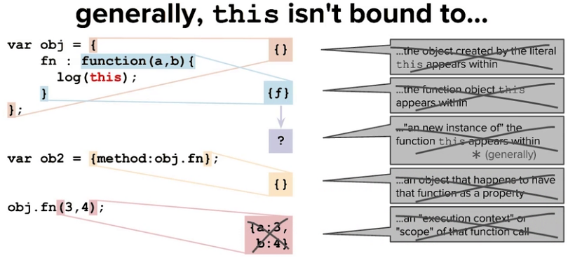
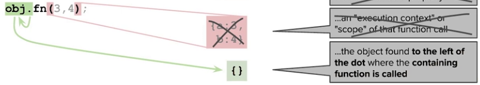
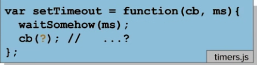
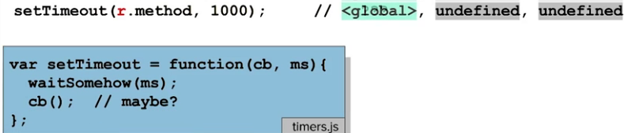

### 0. 序言

关键字this其实就是function中的一个参数，它和函数的普通参数只有两点不同：

1. this不需要另取名字
2. this绑定值的方式不同（绑定值：向this传递值），一共有5种方式

### 1. 关键字this
+ 表示绑定数据的标识符，但是在你的代码中并不明确表明具体绑定哪个数据，而是动态地绑定到某个对象。
+ 由编译器决定this绑定的数据，决定规则和决定普通占位参数的规则并没有很大不同。
+ this绑定的对象是人类直觉判定当前调用方法或者构造函数时的焦点对象。

### 2. this不指向以及指向哪些对象？

1. 不是this存在的那个函数对象
2. 不是this存在的那个函数对象所在的对象字面量
3. 不是函数调用时的execution context
4. 通常也不是函数的实例（有例外）
5. 而是点操作符左手边的那个对象

> The object that a function is looked up upon when it's being invoked, that object is what the keyword, this, will be bound to.

*必须强调的是：有函数定义的那个对象并不是函数this指向的对象，this只是函数调用时点操作符左手边的对象，也就是说this只和函数调用时刻相关。*

### 3. this绑定值的几种情况

#### 3.1 当函数作为方法调用时——为this绑定值的点操作符左手边定律(dot call)

当点操作符右手边的函数作为对象的方法而调用时，一个参数即刻被传入到这个函数中，即点操作符左手边的对象作为一个参数被传入到这个函数中，在函数中这个参数叫做this。

总结：当函数作为对象方法调用时，点操作符左手边的对象作为参数输入函数，绑定到this上。之所以会这样，源于在面向对象编程环境中，每一方法的调用都存在一个焦点对象，我们通过向函数中传入这个对象参数，正是javascript语言的必然要求：一切方法都是对象的方法，不能脱离对象谈问题。

#### 3.2 如果没有点操作符，只是调用某个方法时——this绑定默认值

这种情况下，this绑定默认对象，Global对象，也就是window对象（浏览器环境中的全局对象，Global作为window对象的一部分加以实现）

**点操作符的作用其实就相当于为this指定具体的参数**，所以点操作符左手边的对象就是具体传入函数的this参数值。**当没有点操作符时，也就没有左手边的对象。在这种情况下，this只能使用默认值，也就是Global对象**，就像占位参数没有实际的参数传入时，会被默认的undefined值所代替一样。

this存在默认值的设定也是因为**一切方法都是对象的方法，不能脱离对象谈问题**。

#### 3.3 如果我们想把this绑定到一个对象，但是函数并不是这个对象的属性时——为this绑定其他值：函数的call方法

我们之前讨论的问题都是根据点操作符进行this参数的判断，那其实是有前提的：能使用点操作符说明函数是这个对象的属性，但是如果我们现在想把一个不是某个对象属性的函数的this绑定到这个对象，要怎么办呢？（肯定不能利用点操作符左手边绑定原则了，因为这个对象没有这个方法，因而也就无法通过点操作获取对象的这个方法）

使用函数的call方法可以重写this的默认值，从而设置成你希望的任意对象。甚至当函数是作为某个对象的属性而被调用，call方法甚至会改写方法的访问规则，最终将this绑定的对象改写为call方法中设定的对象。

#### 3.4 当函数作为回调函数被调用时，比如setTimeout函数中的回调函数

一开始研究函数作为setTimeout的回调函数进行调用时，只有当我们分析了setTimeout的源代码之后，才能更好地理解作为setTimeout的回调函数究竟是怎么被调用的，才能知道究竟各种参数是怎么被绑定到这个函数中的参数上的。

假设setTimeout这个函数的源代码别定义在timers.js文件中，它的内部代码如下所示：整个函数的参数包括一个回调函数和一个等待的时间参数。具体所要实现的内容是：先等待一定的时间，然后再执行回调函数。那么问题出现了，究竟setTimeout函数会向cb回调函数中传递什么数值呢？实际上，setTimeout无从知道你想向cb回调函数中传入什么数值，所以，最终setTimeout也就什么参数都不传递，而是直接调用这个回调函数。所以，占位参数就会被赋予undefined。那么this参数呢？先回想一下我们之前用过的this参数确定规则。这个规则是：函数调用时点操作符左手边定律。那么我们究竟要根据下图中的哪一行代码使用这个规则呢？那就是cb()这行代码，但是我们发现它没有点操作符，所以根据规则，我们知道它的this将被设置为默认值Global。最终，我们发现，我们假设的这个setTimeout函数无法应用dot call 的this绑定规则，当然也没有没有使用call绑定规则，以至于this只能绑定默认值。

现在问题升级了，如果我们向setTimeout函数中传入的回调函数是以某对象的方法的形式出现的呢？这时this的绑定值会发生改变吗？提前告知答案：依旧是Global对象。为什么？始终必须铭记的是，如何确定this绑定的值——要去函数调用的地方去找，而不是去函数定义或者函数作为对象方法的地方去找。那么问题的关键仍然是在setTimeout源代码中。源码中并没有颜色对象，也就是说它只认回调函数，并不认识你传递过来的颜色对象。既然它不认识，那么就会直接忽略它。

>Generally, people find it tempting to imagine that since we did a property lookup on the red object, perhaps that lookup event would have some bearing on the keyword this inside the function. But this moment is irrelevant since only the moment of call time influences how the parameter this will get bound.

因为源码中函数调用的地儿，并没有点操作符，所以，不管你传递的是fn，还是r.method，结果都一样，this只能绑定Global对象，也就是默认值。

类似setImeout函数中传入函数参数存在的问题其实很常见，结果总会出乎你的意料。回调函数是某个系统中的固有设计，当你向这个系统传入函数参数，那这个函数就会在这个系统中被调用，而且如何调用都是系统本来就规定好的，不是你能控制的。这种情况下，你就无法随你所愿地将this值绑定到特定的对象上。所以，当你将函数作为参数传入另一个函数中时，一定要十分小心地对待函数参数的绑定问题，不然，结果就会出乎意料。不过，还是有一个简单的方法让你脱离这复杂的参数绑定问题的苦海，如下所示：

向setTimeout函数中传入一个匿名函数，这个匿名函数什么都不做，各种参数都是默认值。然后，你在这个匿名函数内部放上你的真正目的函数，现在各种参数值的绑定问题，就都由你说了算。之所以可以这样做，是因为当我们按照这种方式传递函数参数后，setTimeout系统执行回调函数后，实际上就把外层的匿名函数执行了而已。匿名函数一旦执行，setTimeout系统也就没有威力了，匿名函数中的实体函数再执行时，就不受setTimeout系统的参数约束了。

#### 番外：this如果直接出现在全局作用域中，而不是出现在functional scope中呢？

我们知道函数中的占位参数是局部变量，所以无法在全局作用域中访问到这个变量。this其实也是functional scope中的参数，也是局部变量，类比而言，我们也希望this不会在全局作用域中被访问到。但实际情况并非如此，this在全局下可以获取，为默认值Global。这点令人困惑，好在已经在高版本的标准中被移出了（chrome控制台中仍能获取，为默认值Global对象，也就是Window对象实例）。

#### 3.5 最后一种this绑定值的方式

这涉及到new操作函数中，this的绑定值问题。new操作并不会影响到占位参数的值绑定问题，但是this值绑定却受到很大程度的影响。关于这种this绑定的情况，我们要知道new操作会导致this绑定到构造器新创建的对象上。

### 4. 总结

关键字this的重要性在于：它是函数对象中一个重要参数，通过this参数的值绑定，就能把函数作为任何其他对象的方法进行调用（即使它不是这个对象的方法，又有什么关系呢？只要你为this绑定了合适的对象值，就可以了）。而且，通过this绑定不同对象，我们就能节约更多的内存，因为不需要额外的内存空间来存储方法，只要通过绑定this，就能调用其他对象的某个方法。

总之，一切方法都是对象的方法，对象中存储着方法调用时需要的数据，所以不能脱离对象谈问题，那就好比空中楼阁，没有实际意义。而this参数让我们能够调用指定对象的某一方法。

### 彩蛋：小剧场

对象A有个计算形体比例的方法`xtbl()`，非常好用。对象B知道后，也好想算算自己的形体比例好不好，但是对象B没有这个`xtbl()`方法，也就无法计算。

对象B把自己的苦衷向对象A一顿诉说，对象A说：这个好办，我把我的`xtbl()`方法借你用就行了。

对象B破涕为笑，说：那怎么个借用法儿呢？

对象A说：简单，只要调用`A.xtbl.call(B,P1,P2,P3)`，你把你的身高、体重、三围的数值替换P1,P2,P3即可。

对象B一番动作后，成功算出了自己的形体比例，结果什么的不重要……不过对象B不解：怎么这么简单？这里面都发生了什么？

对象A说：`A.xtbl`表明方法是我的，然后通过`.call()`调用，将我的这个方法绑定到你的身上，同时传入方法调用时需要的基础信息，这样就可以了。

对象B：哦哦，原来是这样啊。

#### 参考资料

所有图片截取自[Object-Oriented JavaScript](https://cn.udacity.com/course/object-oriented-javascript--ud015)相关视频